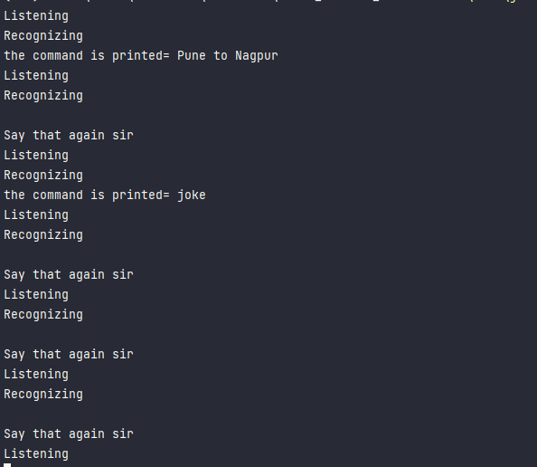

<h2>Jarine Virtual Assistant</h2>

 Requirements for setting up 

req.txt

``pip install -r req.txt``

**Simple execution way is, executing the build executable.**

``C:\Users\{username}\Documents\Jarin_Virtual_assistant\env\Scripts\python.exe C:/Users/{username}/Documents/Jarin_Virtual_assistant/jarine_va.py``

<h3>Navigate to executable package</h3>

``Under Dist directory > jarine_va > jarine_va.exe``

